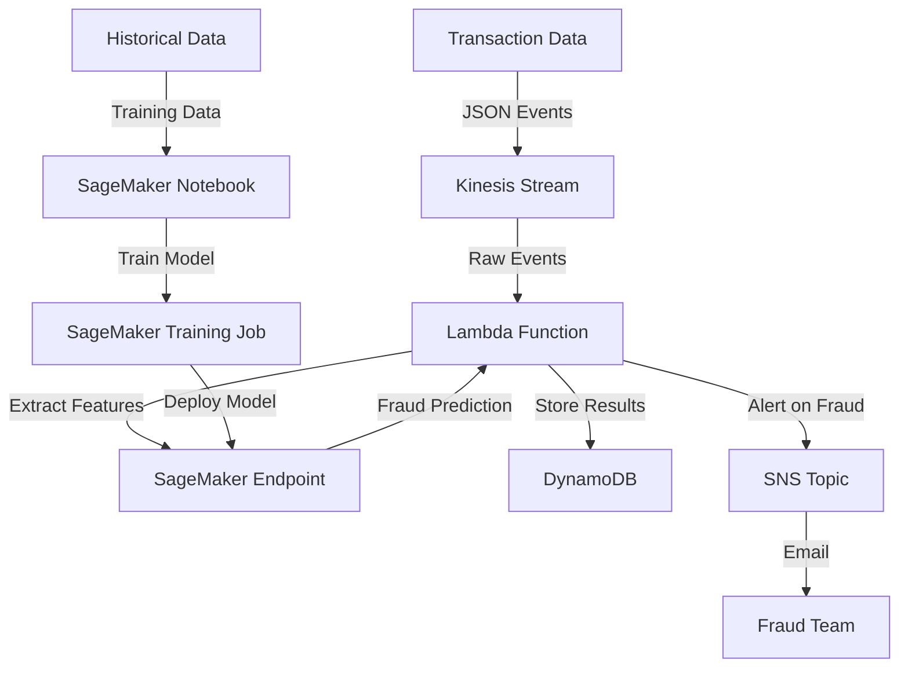

# Real-time fraud detection system

this is documentation for real-time fraud detection pipeline that detects potentially fraudulent transactions for e-commerce company. system processes transaction data, analyzes patterns, and flags suspicious activities using machine learning model.

## System architecture



## Overview

### Data flow
1. transaction data arrives as json events into kinesis stream
2. lambda reads events, extracts features for fraud detection
3. lambda calls sagemaker endpoint to get fraud prediction
4. results are stored in dynamodb for record-keeping
5. if fraud detected, sns alert sent to fraud investigation team

### Infrastructure
- **aws kinesis**: ingests live transaction data
- **aws lambda**: processes events and invokes ml model
- **aws s3**: stores historical data and model artifacts
- **aws sagemaker**: hosts ml model for inference
- **aws dynamodb**: stores transaction results
- **aws sns**: sends alerts for fraud cases

## Key files

### Infrastructure setup
- **cf.template**: cloudformation template that creates required infrastructure
- **ci-cd.yml**: github action workflow for continuous integration
- **on-start.sh**: setup script for sagemaker notebook instance

### Data processing
- **generator.py**: creates historical data with both normal and fraud transactions
- **index.py**: lambda function that processes transactions and calls model
- **utils.py**: helper functions for data processing

### Model training
- **sagemaker_fraud_detection.ipynb**: notebook for model development and training
- **config.py**: configuration values used across environment

# implementation steps

follow these steps to replicate this fraud detection system in your own environment:

## 1. repository setup

```bash
# clone the repository
git clone https://github.com/sparshgoyal024/ssense.git
main branch
```

## 2. configure github secrets

in your github repository, go to settings > secrets and add:

- `AWS_ACCESS_KEY_ID`: your aws access key
- `AWS_SECRET_ACCESS_KEY`: your aws secret key
- `AWS_REGION`: your preferred aws region (e.g., us-west-2)

### Create a environment

- `ENVIRONMENT`: set as "production"

## 3. deploy infrastructure

push changes to the main branch to trigger the ci/cd pipeline:

```bash
git add .
git commit -m "initial deployment"
git push origin main
```

monitor github actions tab to see deployment progress. the pipeline will:
1. upload code files artifacts to s3
2. deploy cloudformation template
3. setup required aws resources
4. build and trigger lambda code for historical data

you may need to manually approve deployment at certain pipeline steps.

## 4. train the model

1. navigate to aws console > sagemaker > notebook instances
2. find and open the created notebook instance
3. open `sagemaker_fraud_detection.ipynb`
4. execute each cell sequentially to:
   - generate historical data
   - perform feature engineering
   - train the xgboost model
   - deploy the model to a sagemaker endpoint
   - evaluate model performance

this is a manual step that could be automated in future versions.

## 5. test the system

1. use the notebook to generate test transactions:

```python
# Generate a batch of transactions to test the system
test_transactions = generate_test_transactions(10, fraud_ratio=0.3)
send_transactions_to_kinesis(test_transactions)
```

2. check dynamodb to verify transaction processing:
   - go to aws console > dynamodb > tables
   - select the created table (ssense-fraud-transactions)
   - explore items to see processed transactions with fraud predictions

3. verify sns notifications by checking the email inbox linked to the sns topic

## Features engineering

### transaction-based features
- **amount**: transaction value (fraudulent transactions often have unusual amounts)
- **device_type**: mobile/desktop/tablet (some devices show higher fraud rates)
- **is_vpn**: whether transaction is through vpn (fraudsters often use vpns)
- **card_type**: credit/debit/gift (gift cards have higher fraud rates)
- **status**: approved/pending/declined (status can indicate suspicious activity)

### time-based features
- **hour_of_day**: fraud often happens during night hours
- **day_of_week**: weekend vs weekday patterns
- **is_weekend**: higher fraud rates on weekends
- **is_night**: transactions between 10pm-6am are higher risk

### location features
- **location_risk**: risk score based on transaction origin
- **location_fraud_rate**: historical fraud rate for location

### user behavior features
- **user_transaction_count**: new accounts have higher fraud rates
- **user_avg_amount**: deviation from user's typical spending
- **amount_zscore**: how many standard deviations from user's average
- **is_unusual_amount**: flag for unusually high/low amounts
- **is_largest_tx**: is this user's largest transaction

- **amount**: transaction value is key because fraudsters often make unusual purchases
  ```python
  features_dict['amount'] = float(transaction.get('amount', 0))
  ```

- **device_type**: fraudsters may prefer specific devices (mobile phones are common)
  ```python
  # One-hot encoding for device type
  for dev in ['mobile', 'desktop', 'tablet']:
      features_dict[f'device_type_{dev}'] = 1 if device_type == dev else 0
  ```

- **is_vpn**: use of vpn can be suspicious as it hides real location
  ```python
  features_dict['is_vpn'] = 1 if transaction.get('is_vpn', False) else 0
  ```

- **card_type**: gift cards particularly show higher fraud rates
  ```python
  # Card type one-hot encoding
  for card in ['credit', 'debit', 'gift']:
      features_dict[f'card_type_{card}'] = 1 if card_type == card else 0
  ```

### temporal features

time patterns are strong indicators of fraud:

- **hour_of_day**: late night hours see more fraud
  ```python
  features_dict['hour_of_day'] = timestamp.hour
  ```

- **is_weekend**: weekend transactions have different risk profiles
  ```python
  features_dict['is_weekend'] = 1 if timestamp.weekday() >= 5 else 0
  ```

- **is_night**: transactions between 10pm-6am are higher risk
  ```python
  features_dict['is_night'] = 1 if (timestamp.hour < 6 or timestamp.hour >= 22) else 0
  ```

### location-based features

location provides strong signals about fraud risk:

- **location_fraud_rate**: historical fraud rate for this location
  ```python
  features_dict['location_fraud_rate'] = self.location_fraud_rates.get(location, 0.05)
  ```

- **one-hot encoded locations**: capture specific high-risk locations
  ```python
  # Location one-hot encoding
  for loc in self.location_fraud_rates.keys():
      features_dict[f'location_{loc.replace(", ", "_").lower()}'] = 1 if location == loc else 0
  ```

### user behavior features

these compare current transaction to the user's history:

- **user_transaction_count**: new accounts have higher fraud rates
  ```python
  features_dict['user_transaction_count'] = user_stats.get('transaction_count', 1)
  ```

- **amount_zscore**: standard deviation from user's typical spending
  ```python
  if user_amount_std > 0:
      features_dict['amount_zscore'] = (features_dict['amount'] - user_avg_amount) / user_amount_std
  else:
      features_dict['amount_zscore'] = 0
  ```

- **is_unusual_amount**: binary flag for suspicious amounts
  ```python
  is_unusual = 0
  if user_amount_std > 0 and abs(features_dict['amount_zscore']) > 2:
      is_unusual = 1
  features_dict['is_unusual_amount'] = is_unusual
  ```

- **is_new_user**: explicitly flag new users
  ```python
  features_dict['is_new_user'] = 1 if features_dict['user_transaction_count'] <= 3 else 0
  ```

## ml model & training

model uses xgboost for classification with these advantages:
- handles imbalanced data (fraud is rare event)
- works well with mix of categorical/numerical features 
- less impacted by outliers
- captures non-linear relationships

training process:
1. historical data loaded from s3
2. features extracted and processed
3. training with hyperparameter tuning
4. model evaluation using metrics like precision, recall, auc
5. deployment to sagemaker endpoint

## Tradeoffs considered

### 1. batch vs real-time processing
- **tradeoff:** real-time provides immediate fraud detection but adds complexity and cost compared to batch. batch would be cheaper but allows fraudulent transactions to complete before detection.
- **decision:** real-time approach worth extra complexity for immediate fraud prevention

### 2. model selection
- **tradeoff:** xgboost gives good accuracy without needing huge datasets that deep learning requires. logistic regression would be simpler but miss complex patterns
- **decision:** xgboost balanced complexity and performance without requiring specialized hardware

### 3. feature computation
- **tradeoff:** hybrid approach balances performance vs accuracy. computing everything in real-time would add latency; pre-computing everything would miss latest user behavior
- **decision:** hybrid approach keeps response time under 200ms while maintaining accuracy

### 4. storage strategy
- **tradeoff:** dynamodb provides fast queries for recent transactions; relational db would enable complex joins but cost more for high throughput; s3 would be cheaper but slower for lookups
- **decision:** dynamodb meets immediate needs while keeping costs reasonable

### Why kinesis:
- **real-time processing**: enables sub-second processing of transactions
- **replay capability**: ability to replay events if processing fails
- **ordered delivery**: maintains transaction sequence within shards

1. **sqs (simple queue service)**: why rejected: ordering important for sequential user transactions, replay critical for recovering from processing errors

2. **kafka (msk)**: why rejected: added operational complexity not justified by the current volume (under 1000 tps)

3. **direct api gateway integration**: why rejected: lacks resilience needed for financial transactions, no ability to handle traffic spikes

### Why lambda:
- **automatic scaling**: handles variable transaction load
- **pay-per-use**: cost efficient for bursty traffic patterns
- **event-driven**: native integration with kinesis
- **managed service**: no server maintenance

1. **ec2 instances with auto-scaling**: why rejected: operational overhead too high compared to benefits, scaling less responsive than lambda

2. **ecs/fargate**: transaction processing fits well within lambda constraints, didn't need container benefits

3. **step functions with lambda**: processing flow is straightforward enough for single lambda

### Why dynamodb:
- **performance**: consistent single-digit millisecond latency
- **scaling**: handles variable transaction volumes without provisioning
- **ttl feature**: automatically expires old transactions (cost saving)
- **serverless integration**: works well with lambda

1. **rds (postgresql/mysql)**: why rejected: access patterns are simple (lookup by id), relational features not needed for main processing

2. **s3 + athena**: why rejected: too slow for real-time fraud detection, better for historical analysis

3. **elasticache (redis)**: why rejected: persistence important for fraud records, cost not justified by performance needs

### Assumptions
- fraud rate around 0.5-3% of transactions
- users have consistent purchasing patterns

### Caveats
- not designed for multiple payment processors
- location data is simplified (could be enhanced with ip data)  
- system doesn't handle extreme volume spikes (like black friday)
- not optimized for very large product catalogs

### Improvements

current implementation requires manual running of sagemaker notebook to train the model. this could be automated using sagemaker pipelines or step functions in future version.

- kinesis data stream simulation is not kept on due to cost constraints, but tested from locally data stream in real-time (added a snippet to stream data in notebook code to verify)
- add a/b testing for different models
- implement explainability for fraud predictions
- add velocity checks for rapid transaction patterns
- integrate with device fingerprinting solutions
- enhance model with network effects (connections between users)

## challenges

some of the challenges I faced:

1. **missing user history**: for new users, I lacked historical data. solution was to use default values and an explicit "is_new_user" flag.

2. **feature correlation**: many features were highly correlated. I ultimately kept them as xgboost can handle correlation, but this needs monitoring.

when analyzing the model, important factors realised:

1. **amount_zscore**: deviation from user's normal spending
2. **is_vpn**: vpn usage correlates strongly with fraud 
3. **is_night**: nighttime transactions had 3x higher fraud rate
4. **location_fraud_rate**: certain locations have persistent fraud issues
5. **user_transaction_count**: new accounts show higher risk


### handling imbalanced data

fraud typically represents only 0.1-3% of transactions, creating imbalanced training data. to address this I:

1. used **scale_pos_weight** parameter in xgboost (value of 10)
2. adjusted evaluation metrics to focus on precision/recall rather than accuracy
3. modified classification threshold from default 0.5 to 0.3 
4. used stratified sampling in train/test splits

```python
X_train, X_test, y_train, y_test = train_test_split(X, y, test_size=0.2, random_state=42, stratify=y)
```

key parameters that significantly improved performance:

- **max_depth**: 7 (deeper trees captured complex patterns)
- **scale_pos_weight**: 10 (addressed class imbalance)
- **subsample**: 0.8 (prevented overfitting)
- **gamma**: 1.2 (regularization to control complexity)
